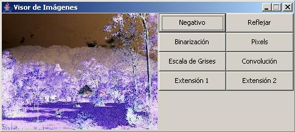
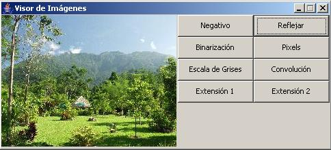
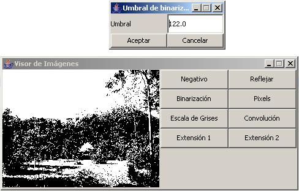
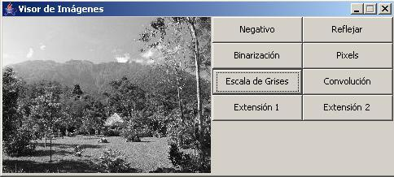
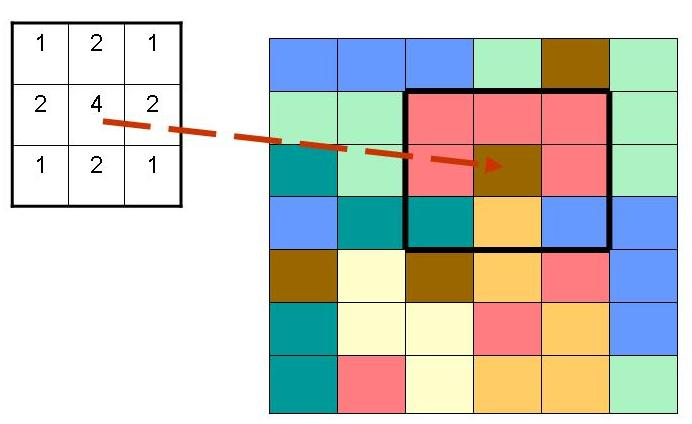
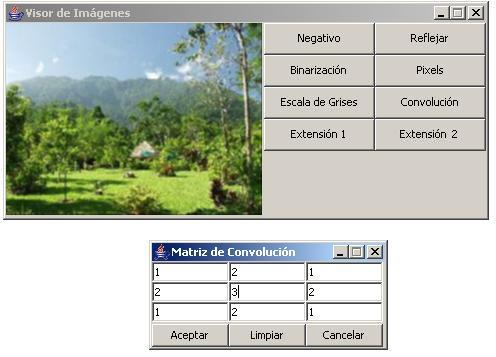

# Statement

It is necessary to build an application that allows viewing images in BMP format.
The BMP format allows to save the color information of each pixel in the image.
The color of a pixel is represented in the RGB (Red-Green-Blue), in which the color
is formed by the combination of three components (red, green and blue) each of which
is represented by a number that shows the proportion of the component in the
final color.  The application will display an image which can be a maximum width
of 400 pixels and a maximum height of 300 pixels.  When loading an image, if the
size is higher than the maximum, only the portion of the image determined by the
maximum dimensions must be taken.  You can also load images of smaller sizes to
the maximum dimensions.
In addition to display the image, the program must provide six (6) methods for
image processing. Each of these
processing methods are applied to the image when you press the appropriate button.

## Transformation 1: Negative

To calculate the negative image the negative oo each pixel will be calculated.
To do this we must subtract 255 to each component (maximum value for a component)
and take the absolute value of the subtraction. With the new values of the
components a new color is made up.

Example: For example image, the result of applying the transformation 1 is:

## Transformation 2: Flip Vertical

Description: It allows you to reverse an image vertically. This will exchange
the columns of pixels in the image: 
The first to last, the second to the last but one, etc.

Example: For example image, the result of applying the processing 2:

## Transformation 3: Binarization

Description: It consists in carrying the colors of the image in two colors:
Black and White. A threshold is set and the pixels with colors that are above
or equal to the threshold are changed to white and below are changed to black. 

In this case the threshold is suggested as the average color of the image.
To calculate the average color of a group of pixels, each of its components
are averaged and a new color is created with these averages as components.

Example: For example image, the threshold suggested is the average color value:

## Transformation 4: Pixel

Description: For this transformation the image is divided into small regions
of more than one pixel, and the average color for that region is found
(see transformación3 for the average color description), then the color of the
entire region is changed to the average color.
The regions must be of a height and width that are divisors of the width and
height of the total image.
In this case will look for the dimensions of the region as:
Width region: less divisor greater than one of the image width.
High region: less divisor greater than one of the image height.

Example: For example image, the result of applying the transformation 4 is:

## Transformation 5: Grayscale

Description: To change to a gray image, the components of each pixel is averaged
and a new color is created in which each component (RGB) has the value of the average.

Example: For example image, the result of applying the transformation 5 is:

## Transformation 6: Convolution

Description: The convolution is to operate for each pixel, its region of
neighboring pixels (the pixel included), 
with some factors that are entered into a square matrix of odd dimension
(for this example we will use a 3x3 matrix). The size of the convolution matrix
defines the region of neighboring pixels.

The way it operates the region of pixels with this matrix is:

The center of the matrix matches the pixel being processed.  Each pixel
(actually, each component of the pixel) in the region is multiplied by its
corresponding factor. 
The results of these multiplications are added.
The previous sum is divided by the sum of the factors that were operated: If
the pixel is near the edge of the image (taking into account the size of the
convolution matrix) do not apply all the factors of the matrix (because not
everyone has a corresponding pixel), only those who were operated. The color
is created with the results of previous operations (which is done for each
component) replacing the original pixel color (the center).
However it may be the case that the sum of the factors is 0: in this case the
division is not performed. 
This can give interesting effects such as edge detection.

The operation of the image with convolution matrix must be made on the original
pixel map and pixels accumulate the transformations made by previous operations
with the matrix.

Example: With the following matrix convolution, the smoothing effect is obtained:

